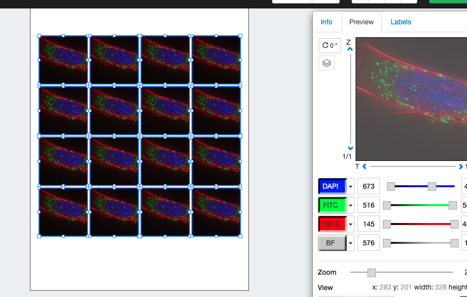
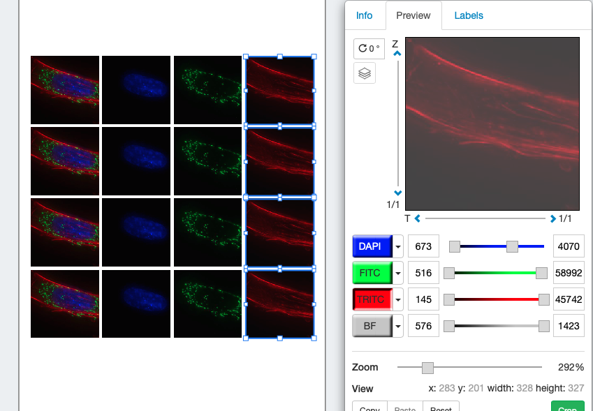
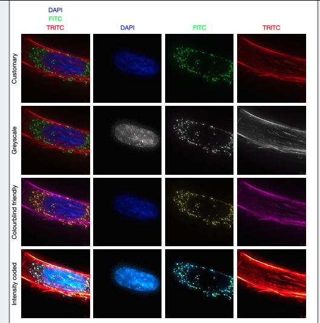

<video width="480" height="320" controls="controls">
  <source src="./1.-Working-with-Channels.mp4" type="video/mp4">
</video>

## Open and make a grid
1. Open the channel example
2. Zoom to the right area
3. Reduce size, make 16 copies
4. Alight to grid / resice

## Turn off the channels in each columnn
* select a column, leave a single channel on
* label columns with channel

## Different Look Up Tables
* on row 2 make grey scale for each (leave col 1 RGB)
* on row 3 replace free with yellow, red with magenta
* on row 4 replace 
	* DAPI -> cyan hot 
	* FITC -> green fire blue
	* TRITC -> red hot

