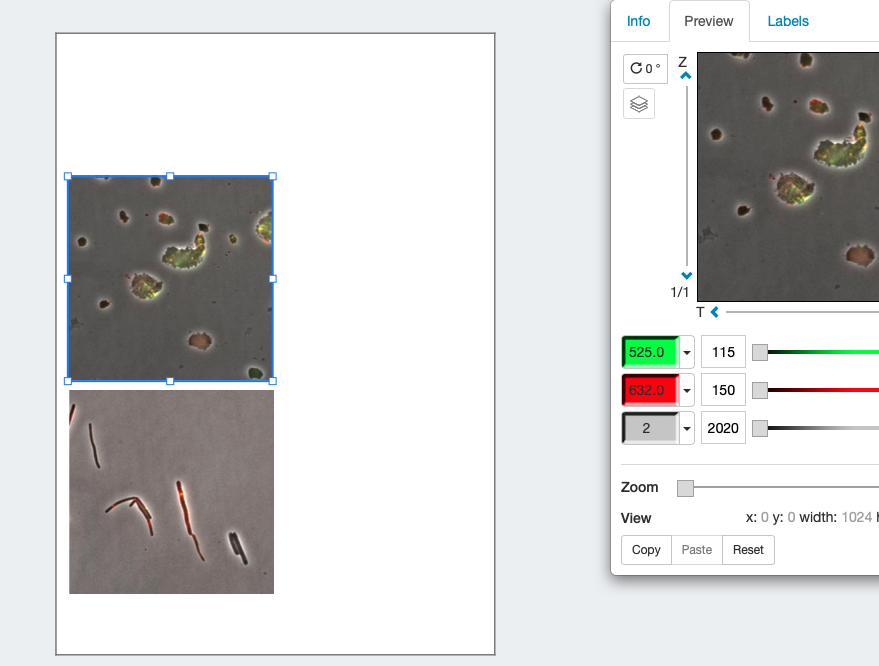
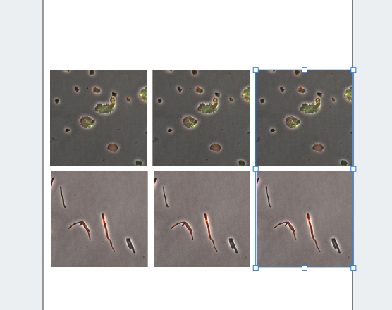
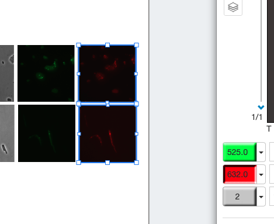
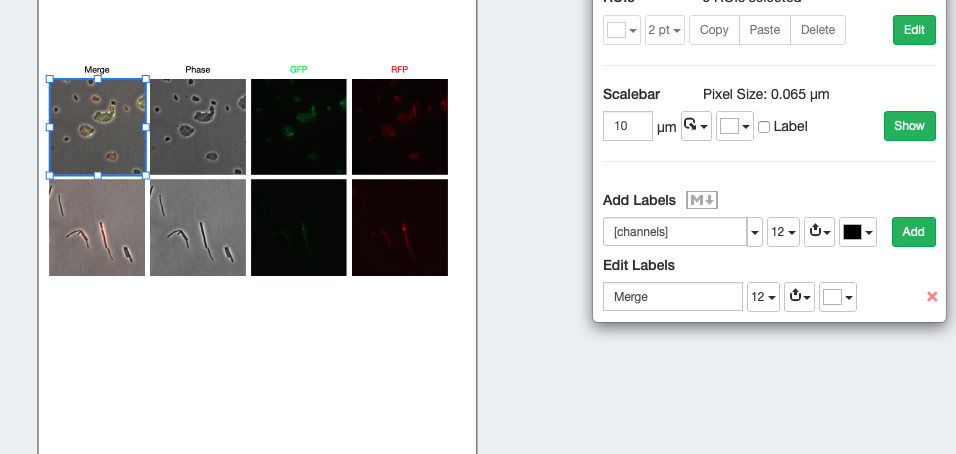
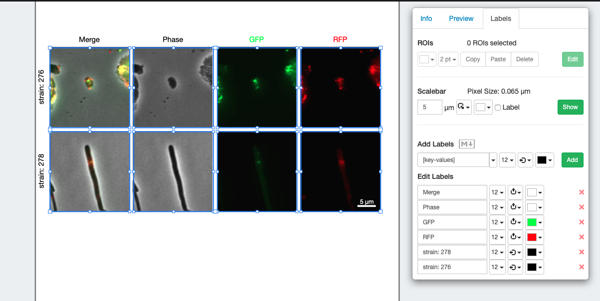
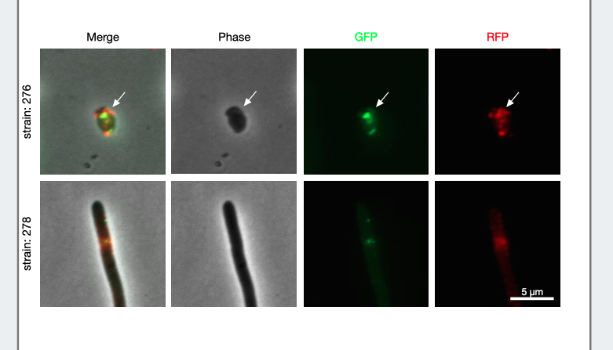

<video width="480" height="320" controls="controls">
  <source src="./2.-Comparing-Channels.mp4" type="video/mp4">
</video>

## Layout the images

* Open the images

* Make four copies, ctrl+C ctrl+V works

* Turn off the channels so each contains a single channel.

## Label the channels, change the first to merge

* In the `Labels` tab, select add labels `[Channels]`
* Adjust B&C across the images

## Zooming
* Select all
* Zoom in
* Select row 
* move to area of interest (all synced)
* Add scale bar
* add strain name

## Adding an arrow
* Select the first image
* ROIs edit
* draw arrow (make it a bit longer)
* copy the copy the Roi
* select the other panels and paste

