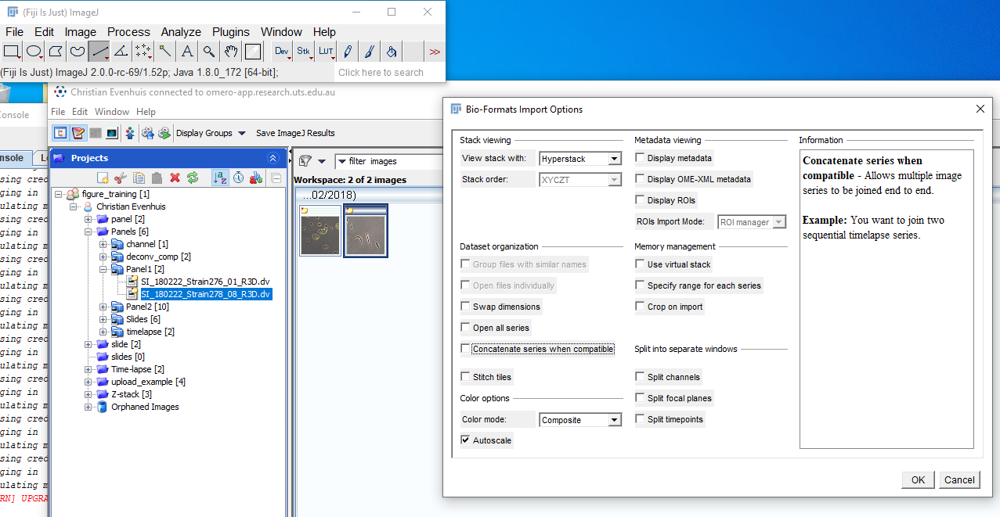
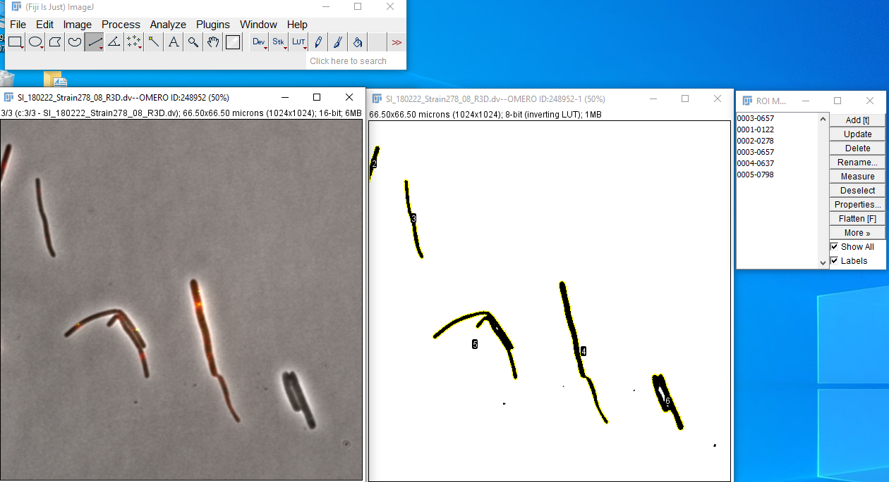
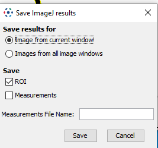
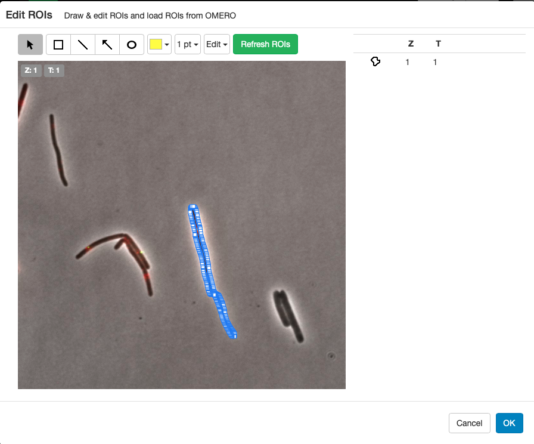
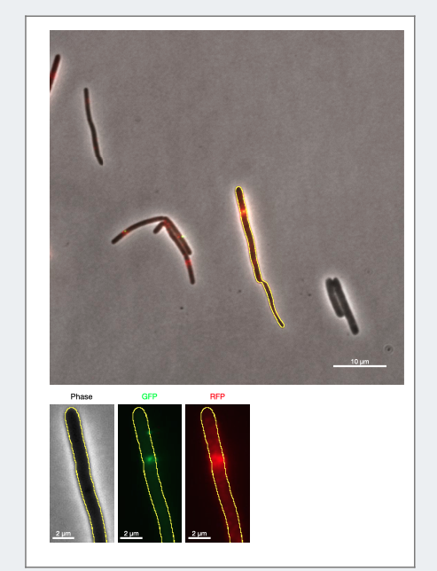

<video width="480" height="320" controls="controls">
  <source src="3.-ROIs-from-Fiji.mp4" type="video/mp4">
</video>

## Create the ROI in FIJI
1. Open Fiji (Windows only at the moment)
2. Connect to OMERO
3. Open image

4. duplicate channel 3
5. Threshold
6. Analyse particles

7. `OMERO > Save ROIS to OMERO`

## Open the image in OMERO.figure
1. Open image
2. Click on ROIs, Load ROIs
3. Add the first one make it Yellow

## Create the figure

1. Copy the image 3 times
2. Scale down for detail
3. resize
4. Channel set or each
5. Add scale bars

