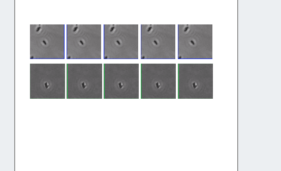

<video width="480" height="320" controls="controls">
  <source src="./4.-Timelapse.mp4" type="video/mp4">
</video>

# Timelapse

## Setup
1. Open image 
2. Slide to end of time
3. Add ROI here

## Select ROIs
1. make 2 copies
2. Crop
3. Make smaller, slide to time 1
4. Make grid

## Create Time panels
5. Add time label on top row
6. Set times to 0,30,60,90,120
7. Add plot foo image.
8. Balance background
9. Add legend

