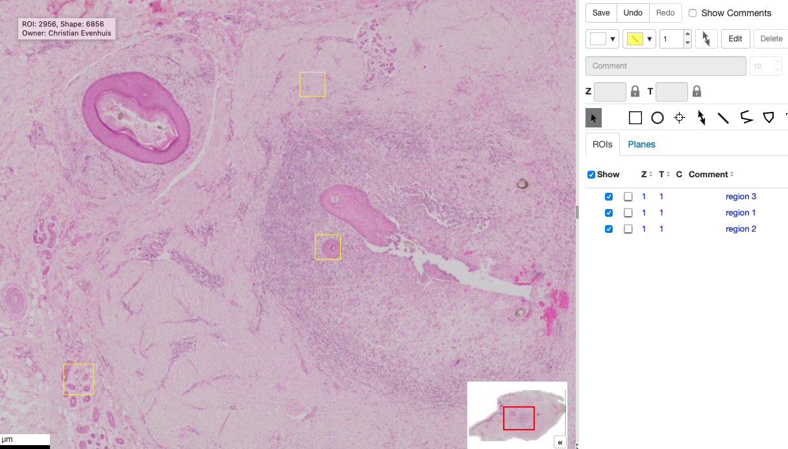
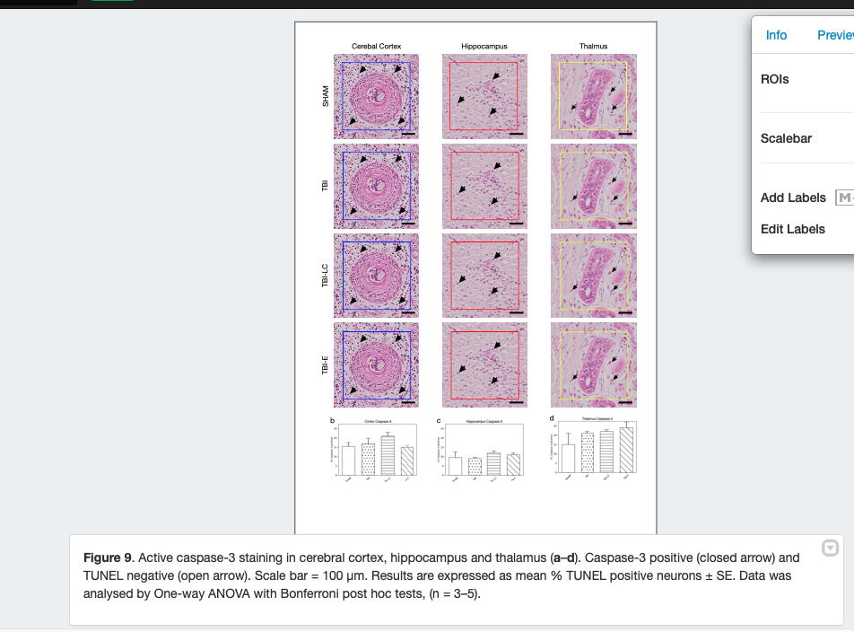

<video width="480" height="320" controls="controls">
  <source src="5.-Slides.mp4" type="video/mp4">
</video>

## Create Regions of Interest (ROIs)

### Find areas of interest 
* Image Open with iviewer
* Select 3 regions of interest
* Look at the rough size of each (250um)

### Create an ROIs for your regions
* In the browser, select the image
* `Scripts > MIF > Add Rect..` enter 250um
* Go back to viewer window
* Replace the old Rois with the new ones (note the areas are precise now)

## Open the image in figure
### Load the ROIS
1. Labels > Rois > Edit
2. Load ROIs.  Add each ROI
3. Make them different colours
4. Click OK

### Create Insets
1. Copy the image
2. Crop (delete ROI -no)
3. Repeat for all row
4. Arrange in line 
5. Select insets, hold shift and reduce the zoom slightly
6. Add scale bars

## Add the figures
* Add image IDs
* Add arrows in ROIs (easier in iviewer mode)
* Align sizes and grids
Add figure legend

>**Figure 9**. Active caspase-3 staining in cerebral cortex, hippocampus and thalamus (**a**–**d**). Caspase-3 positive (closed arrow) and TUNEL negative (open arrow). Scale bar = 100 μm. Results are expressed as mean % TUNEL positive neurons ± SE. Data was analysed by One-way ANOVA with Bonferroni post hoc tests, (n = 3–5).

## Final 
* Delete the thumbnail
* Copy three more times
* Align to grid
* Add figure label

