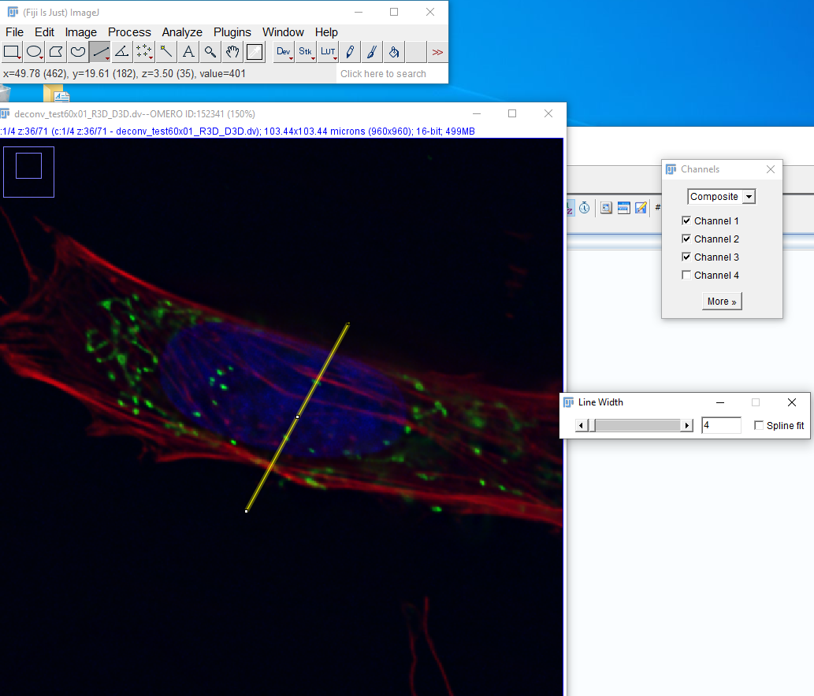
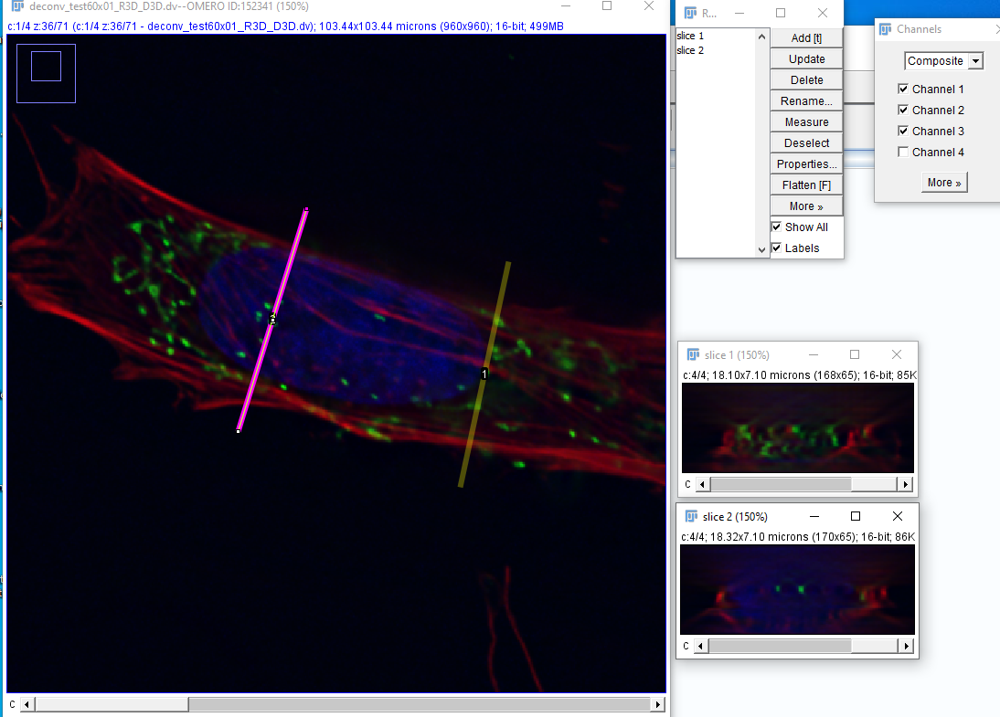
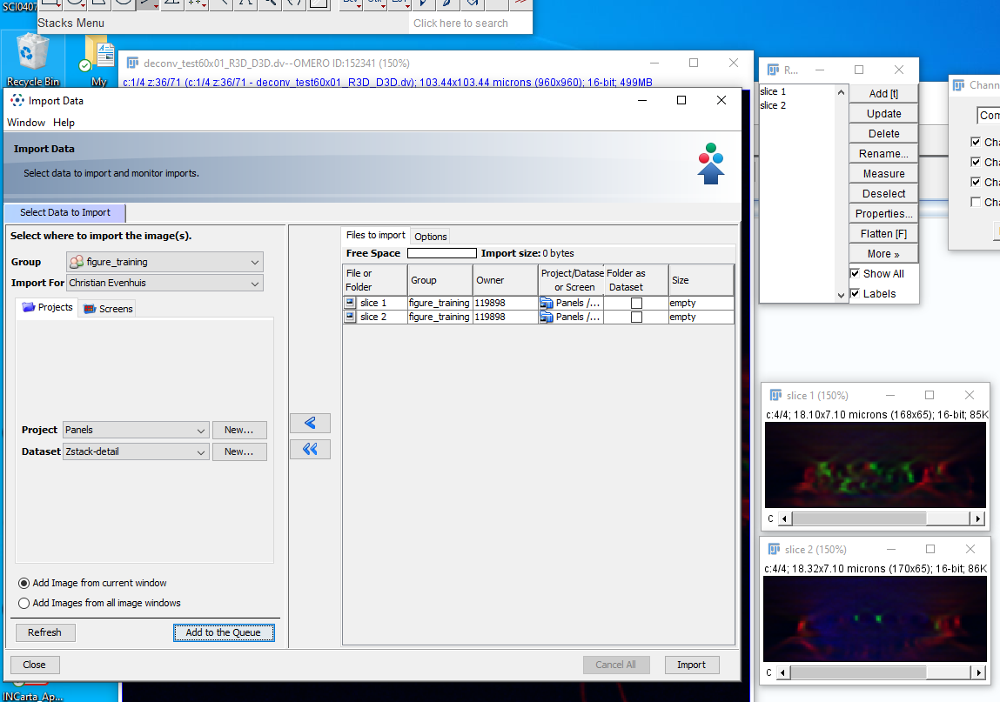
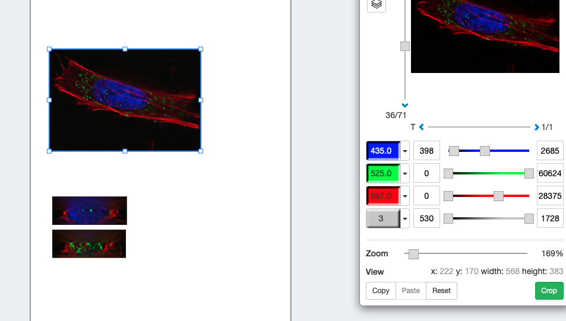
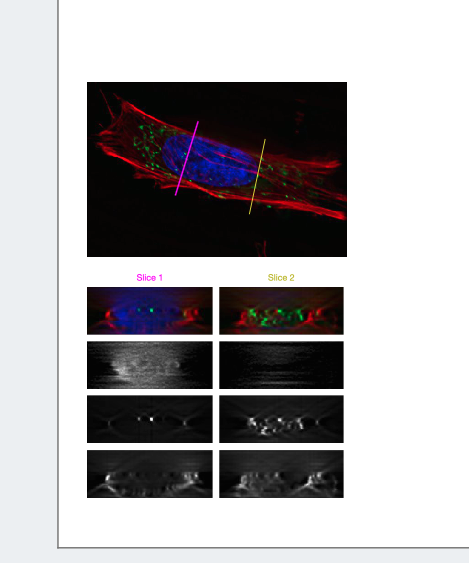



## Create slices in Fiji
* Connect to OMERO in Fiji
* Open image
* Create lines on image and add to ROI manager

* Reslice the stack for each line (`Image > Stacks > Reslice [/]...`)
* Rename the images

* Upload to OMERO from Fiji

## In OMERO
* Open all three image in figure

* Correct B&C

* in Overview, add ROIS

* Setup labels

