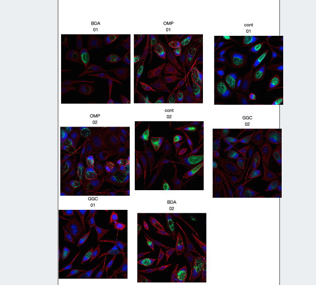

<video width="480" height="320" controls="controls">
  <source src="7.-Complex-Panel.mp4 " type="video/mp4">
</video>

## Add metadata to images
Comparing a set of images by treatment 

Best to add metadata.  Some in the file names:

`BDA_01_40x01_R3D_D3D.dv`

Treatment `_` time `_` magnification `_` time `_R3D_D3D.dv`

### Extract metadata from filenamess
Can add this data quickly to the files.
Add some code to the description of the data set that tells how to chop the filenames up.

`Scripts > MIF > Key Val from Description`

This extracts information from the filename and adds as a key-value pair

## Create the figure
* Select the images, draw a box, shift and command multiple selection
* Open with OMERO.figure

This brings up this page view

### Add labels to the images
1. Select the images
2. Click on the labels tab
3. In the labels drop down select `Key-Value pairs`
4. Click add
5. Select treatment
6. Repeat from step 4 to add time 

This adds the labels to the images

### Arrange into a grid
1. Arrange into grid
2. Remove labels
3. Align to grid
4. Select left column
5. Set label alignment left vertical
6. Add label treament
7. Select top row
8. Add label time
9. Correct the labels (01 - > 24hr, control -> Control )

### Create a statistical plot
1. Analyse your data and create a statistical plot.  Save as a 300dpi tif.

2. Upload to OMERO.  Refresh the dataset view to see the plots

3. Copy the image IDs.  In the figure click `Add Image`

Arrange, align sizes and align to grid

### Add figure legend
Add some random text:

>*Fig. 2*: In vivo imaging of **EGFP** and **YFP** fusion proteins using parallel detection and subsequent emission unmixing. Two-channel im- ages were acquired simultaneously on a Perkin Elmer spinning disc confocal microscope equipped with an emission beam splitter (DualView, OpticalInsights Inc.). The sample was excited at 488 nm with an Ar/Kr laser and the fluorescence signal was split into two channels detecting the 505-530 nm and 530-565 nm range, respectively. 

## Export PDF
Create PDF to share with collaborators.

* Contains a a link to the figure
* Contains links to each image in it

Create tiff with images

* Good for publications
* Original data with each image inset image at pulsation resolution

