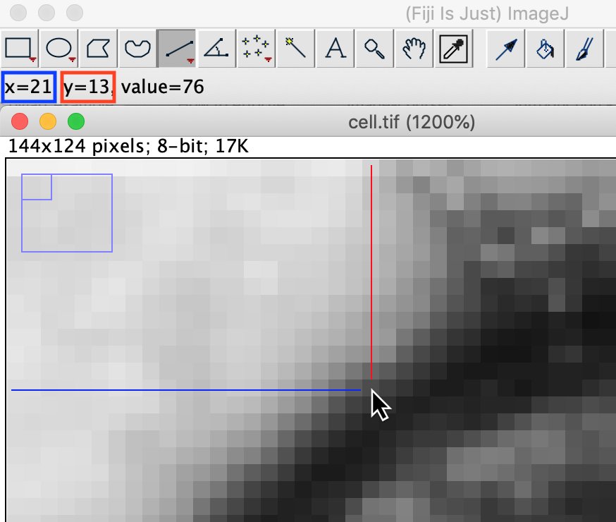
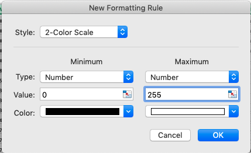
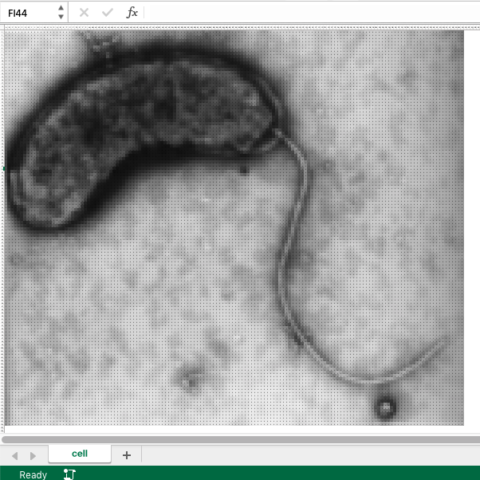
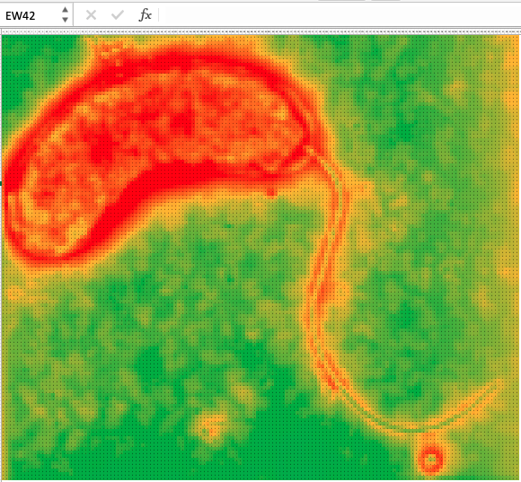

Images are stored on the computer as an array of numbers which can thought of as a spreadsheet. 
To make this connection we will open an image in Fiji, save it as table of numbers and open in Excel. 

## Opening an image

1. Open the image. In the Fiji menu `File > Open` and find the file  `cell.tif`
2. Increase the zoom level until you can see the pixels (`+`)
3. You can pan the image when zoomed in by holding `SHIFT` and cliking the left mouse button and dragging
4. When the mouse is moved over the coordinates and value of the pixel under the pointer is displayed in th Fiji toolbar.

## Exporting an image as numbers

### Export from Fiji:
1. Go to `File > Save As > Image Sequence...`
2. Select a location for the file, `cell.txt`

### Open In Excel:
1. Go to `File > Open` as select the file `cell.txt` that you just made
2. This will open the Text Wizard.
   * Choose `Delimited`
   * Choose `Tab`
   * Press `Finish`

You will now see a table of numbers in Excel. 

3: Select all cells

4: Adjust to cell size to have same width and height (this makes the pixels square)



## Look Up Tables 

To display the image on the screen the computer colours or shades each pixel based on its value. 
The rule to determine what colour to shade a pixel is known as the Look Up Table.

### Creating a Look Up Table in Excel

We will create a Look Up Table in Excel using the Conditional Formatting feature.

#### Grayscale LUT
1. Select all the cells
2. Click on `Format > Conditional Formatting`
3. Click on the plus or `Add new rule`
	 * click plus
	 * Set the type to `Number`
    * set minimum value 0 : color black
    * set maximum number 255 : color white
    
4. Set zoom level 10
    

#### Color LUTs
In Fiji:

* `Image > Look Up Tables > Rainbow RGB`

In Excel:

* Conditional formatting
* Edit rule
* 3 color scale. set
    * value 0 Red
    * percentile 25% Orange
    * value 255 Green

    
***Keypoint:*** Brightness and contrast only change the way the image is presented, not the pixel information



