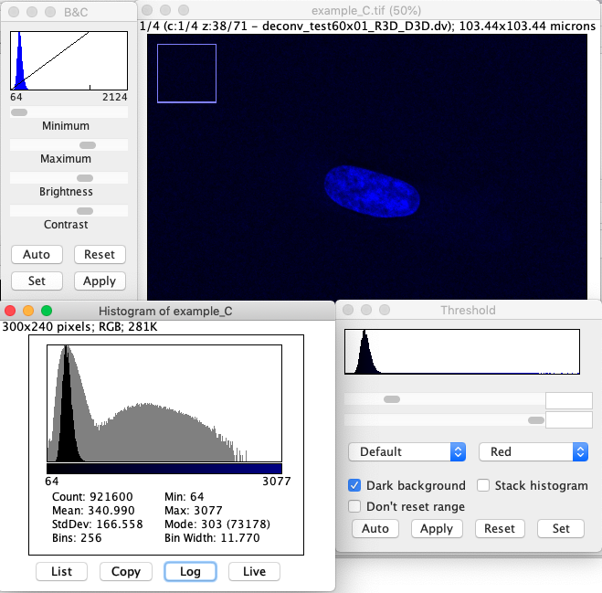

# Measuring

## Line Profile

* Click on the line tool.
* Draw a line
* Press k
* Turn on live
* In Fiji, create a macro:
   * `File > New... > Script`
   * `Language > IJ1i Macro`
   * `makeLine(75,65, 105,65);`
   * `Run`
   * Plot line profile (`k`)

* In Excel Data 
   * Select range: `Sheet1!$BX$66:$DB$66`
   * Insert chart



## Statistics

Enable measurements box
 * some about the shape of  (area, perimeter, Feret's diameter)
 * some about values of pixels in the shape (mean, median, stdev)

## Histograms

In Fiji histomgram can viewed:

* from the `Analyze > Histogram` (press `h`). Whole image or selection, can be live, and has a log option
* through `Adjust > Brightness and Contrast` (press `c`)
* through `Adjust > Threshold` (press `T`)

How to read the histogram, show log scale as well

* Open `example_C.tif`
* Display Brightness and Contrast
* Display the histogram, press the `Log` button.  The dip in the histogram around 700 is where to threshold.
* Threshold the image

Threshold window select different parts of the image

**Keypoint** Line profiles, measurements and histograms are the way to understand the intensities that make up an image. Very useful for segmenting and image through thresholding.


G
Detour - what do the number's mean?

Change to slides

Histogram again, at acquisition.

Histograms in acquisition software too. Good to learn how to read them.
Histogram shows how the intensities in the image file are distributed. Watch for:

separation of signal (cells) from noise (background) * over-exposure, under-exposure
mention the HiLo LUT table, useful in Nikon Software

## Exposure 

The numbers in the file (intensities) are not the number of photons - but is proportional to the number of photons.
Can be calibrated to radiance units - very difficult, usually kept as arbitrary units
Compare intensities - often as ratios

$\exp=4$ 

Parts we can control:
exposure, power settings
lens / sample cleanliness
lamp / laser output
staining
cell life cycle / expression levels
Hard to compare intensities between sittings - easier / better to use controls for each

# Bit Depths
On a histogram the x axis is the range numbers that can be stored, the y is number of pixels in each bucket.
The **bit depth** is the number of bins on the x axis.

* 8-bit 0-255
* 16-bit 0-65,535
* 32-bit huge!

8-bit 256 18-bit 65,536 * 14-bit DV elite * 12-bit Confocal

The large the range the more information is stored, the less chance of over-exposure, and when the image is transformed the results are better

## Converting images
* download `example_C_16bit.tif`
* open it
* display histogram
* copy image 
* make 8-bit show histogram
This is stuffing the 16bits into 8 bits.

## Role of Brightness and Contrast setting

* Open example_C_16bit_trans.tif
* Duplicate image twice
* Set display ranges to low and high
* Convert to 8-bit again, show histogram

When converting to a lower bit depth a choice must be made how to stuff the information into less bins. Brightness and Contrast controls range that used to store the lower bitdpeth image.

## Quantisation 

* Open example_C_16bit_trans.tif
* Histogram, logscale
* C&B set scale `[0,51000]`, show histogram + live
* Duplicate, convert 8bit
* Convert to 16bit
* Multiply by 200 

Notches is known as posterisation or quantisation. Using the suitcase analogy, when the image was converted to 8bit the information was packed into less suitcases.  It is not possible to undo this as it pixel values can't be repacked into their orginal suitcases. 
When converting to a lower bit depth information is lost.

This is why we avoid using lower bit depth formats (like jpeg). Jpeg are worse because they employ gamma and compression other techniques designed be perceived the same as he original despite using drastically less storage data.

### Transformations

* Open `example_C_16bit.tif`
* Open `example_C_8bit.tif`
* Show histograms.

**Keypoint** These images looks the same, ubut underlying data is different. Line profiles, histograms and measurements allows you see this difference - you're eye's may not!




