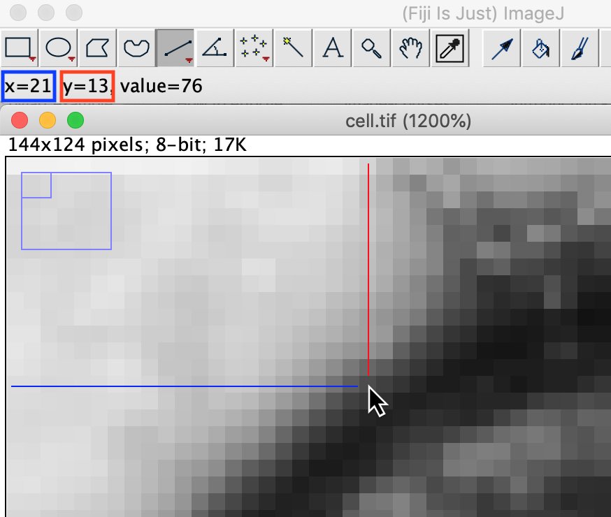

Images are stored on the computer as an array of numbers which can thought of as a spreadsheet. 
To make this connection we will open an image in Fiji, save it as table of numbers and open in Excel. 

## Open the image

1. Open the image. In the Fiji menu `File > Open` and find the file  `cell.tif`
2. Increase the zoom level until you can see the pixels (`+`)
3. You can pan the image when zoomed in by holding `SHIFT` and cliking the left mouse button and dragging
4. When the mouse is moved over the coordinates and value of the pixel under the pointer is displayed in th Fiji toolbar.

## Export the image as numbers

### Export from Fiji:
1. Go to `File > Save As > Image Sequence...`
2. Select a location for the file, `cell.txt`

### Open In Excel:
1. Go to `File > Open` as select the file `cell.txt` that you just made
2. This will open the Text Wizard.
   * Choose `Delimited`
   * Choose `Tab`
   * Press `Finish`

You will now see a table of numbers in Excel. 

<video width="480" height="320" controls="controls">
  <source src="opening_in_excel.mp4" type="video/mp4">
</video>

## Look Up Tables 

To display the image on the screen the computer colors or shades each pixel based on it's value. 
The rule to determine what color to shade a pixel is known as the Look Up Table.

### Creating a Look Up Table in Excel

We will create a Look Up Table in Excel using the Conditional Formating feature.

1. Select all the cells
2. Click on `Format > Conditional Formating`
3. Click on the plus or `add new rule`

